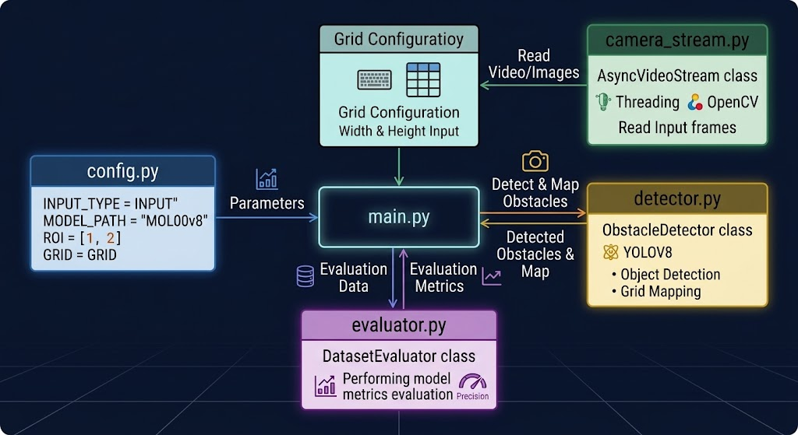
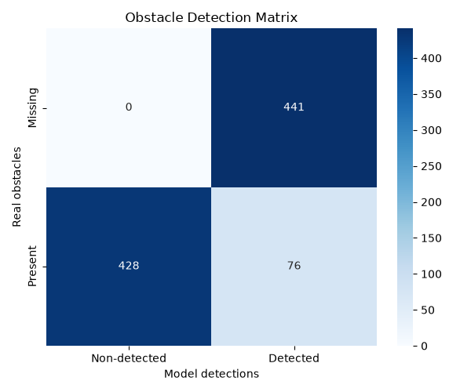

# Computer-Vision
> Aszinkron, több szálon futó videó/kamera adatfolyam-feldolgozó és akadályészlelő rendszer YOLOv8 alapon, rácskoordináta-leképezéssel, ROI (Region of Interest) szűréssel és automatizált adatbázis-értékeléssel.

[](https://www.python.org/)
[](https://docs.ultralytics.com/)
[](https://opencv.org/)
[](https://opensource.org/licenses/MIT)

## Projekt Áttekintés

A rendszer célja, hogy különböző adatforrásokból (Webkamera, RTSP videófolyam, Képm mappa) valós időben dolgozzon fel képeket, és detektálja az objektumokat egy autonóm jármű vagy drón számára.



A pipeline főbb képességei:
* **Többszálú képkocka-beolvasás (Async Threaded Streaming):** Külön háttérszálon futó beolvasás az I/O szűk keresztmetszetek elkerülésére.
* **Térbeli Rácskoordináta Leképezés (Spatial Grid Mapping):** A detektált objektumok bounding boxainak leképezése egy $N \times M$-es lokális rácsra (pl. $10 \times 10$).
* **ROI (Region of Interest) és Frame-Skipping:** Célzott vizsgálati tartományok kijelölése és képkocka-átlépés a számítási kapacitás optimális kihasználásához.
* **Automatikus IoU Értékelés (Evaluator Module):** A feldolgozás végén automatikus mérőszám-számítás (Precision, TP/FP/FN) és konfúziós mátrix generálás.

---

## Tech Stack

* **Nyelv:** Python 3.8+
* **Computer Vision & ML:** `ultralytics` (YOLOv8), `opencv-python`
* **Adatfeldolgozás:** `numpy`, `scikit-learn`
* **Aszinkron & Multi-threading:** `asyncio`, `threading`
* **Vizualizáció & Értékelés:** `matplotlib`, `seaborn`

---

## High-Level Design (HLD)

Az alábbi diagram az aszinkron adatfolyamot és a modulok közötti kapcsolatot mutatja be:

## Fő Modulok és Funkciók

* **`camera_stream.py` (`AsyncVideoStream`):** Külön szálon (`threading.Thread`) tartja frissen a legfrissebb képkockát egy `Lock` segítségével, megszüntetve a kamera pufferelési késleltetését.
* **`detector.py` (`ObstacleDetector`):** Betölti a YOLOv8 modellt, kezeli a ROI transzformációkat, és átszámolja a pixel alapú bounding boxokat relatív $N \times M$-es rácskoordinátákká.
* **`evaluator.py` (`DatasetEvaluator`):** Támogatja a YOLO formátumú annotációk összevetését a modell előrejelzéseivel. IoU küszöbérték alapján elemzi a True Positive és False Negative találatokat.
* **`config.py`:** A teljes csővezeték központi konfigurációja (modell útvonal, ROI arányok, frame skip, rácsméretek).

---

## Telepítés és Futtatás

### Előfeltételek
Python 3.8+ és telepített kiegészítők.

### 1. Repository klónozása és függőségek telepítése
```bash
git clone [https://github.com/vrgdori/Computer-Vision.git](https://github.com/vrgdori/Computer-Vision.git)
cd Computer-Vision
pip install -r requirements.txt
```

### 2. Konfiguráció beállítása (`config.py`)
Állítsd be a kívánt bemeneti forrást a `config.py` fájlban:
```python
INPUT_TYPE = "FOLDER" # Lehetséges értékek: "CAMERA", "RTSP", "FOLDER"
INPUT_SOURCE = "./test/images"
SHOW_PREVIEW = True
```

### 3. Futtatás
```bash
python main.py
```

---

## Mérnöki Döntések és Kihívások

* **Puffer Torlódás Kezelése (Threading & Lock):** A standard `cv2.VideoCapture` pufferelése miatt a lassabb képfeldolgozás (pl. 20 FPS) felhalmozódó késleltetést okoz. A dedikált `AsyncVideoStream` osztály `read_lock` védelemmel mindig csak a legfrissebb képkockát adja át a modellnek, ezzel garantálva a valóban valós idejű reakcióidőt.
* **Készültség és Értékelés automatizálása:** Mappa típusú feldolgozás esetén a leálláskor a rendszer automatikusan lefuttatja a `DatasetEvaluator` modult, amely kigenerálja a `confusion_matrix.png`-t és a részletes `evaluation_report.txt` diagnosztikát.
* **Struktúrált JSON Kimenet:** A detektált akadályok pozíciói és metaadatai JSON formátumban íródnak a standard kimenetre (`stdout`), lehetővé téve a pipeline könnyű integrációját ROS (Robot Operating System) vagy más microservice architektúrák felé.

## Jelenlegi eredmények

